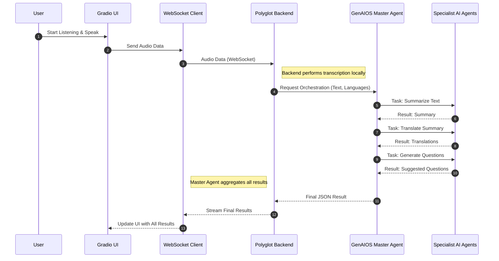
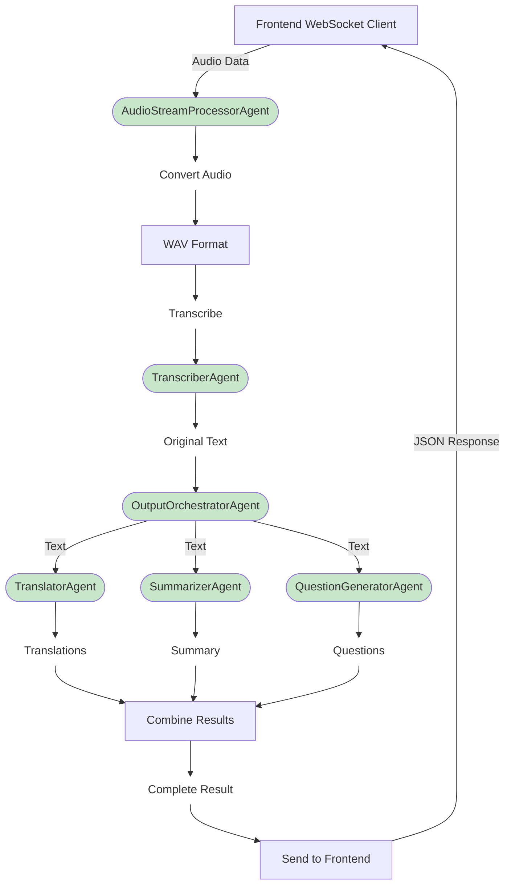

# Polyglot Meeting Whisperer (GenAIOS Based) 🚀

Welcome to the **Agentic Edition** of the Polyglot Meeting Whisperer! This version represents a fundamental architectural evolution of the original concept, moving from a monolithic application to a powerful, orchestrated ecosystem of specialized AI Agents built on the **GenAIOS Protocol**.

[](https://www.linkedin.com/in/abbas-k-a46a362/)


---

## 🌟 Vision: Beyond Transcription, Towards Understanding
In today's globalized world, meetings are the lifeblood of collaboration, but language barriers and information overload create significant friction. The Polyglot Meeting Whisperer was born from a simple yet powerful idea: what if we could not only transcribe our conversations but instantly understand, translate, and summarize them?

This special **Agentic Edition** takes this vision a step further. Instead of one large program doing everything, we've designed an orchestra of intelligent agents, each a master of its own craft, working in perfect harmony to deliver unparalleled results.

### High-Level Architecture

Our system employs a sophisticated, multi-agent architecture where tasks are decoupled and handled by specialized agents. The user interacts with a Gradio UI, which communicates via WebSocket to our backend. The backend, in turn, orchestrates a flow of tasks delegated to the GenAIOS agent ecosystem.


</br>

**Sequence Diagram:**

</br>
This code accurately represents the time-based interaction between the user, the UI, your backend, and the GenAIOS ecosystem.



</br>
</br>

**Agent Flow Diagram:**

</br>
This code represents the internal logic and data flow between the different agents as orchestrated by the OutputOrchestratorAgent.



</br>

## 🛠️ Project Structure

The project is organized into two primary components: the application layer (`polyglot-meeting-whisperer`) and the agent layer (`genai-agentos`). This separation allows for independent development and scaling.

````
├── genai-agentos/ # The core GenAIOS framework
│ └── cli/
│ ├── agents/
│ │ ├── summarizer_agent/
│ │ └── translator_agent/
│ └── cli.py # Script to register & run agents
│
├── polyglot-backend/ # Our FastAPI backend (client for GenAIOS)
│ ├── main.py
│ └── Dockerfile
│
├── polyglot-frontend/ # Our Gradio UI
│ ├── app.py
│ └── Dockerfile
│
└── docker-compose.yml # The master file to orchestrate all services
````
---

## 🚀 Getting Started: Running the Ecosystem

This version relies on Docker and the GenAIOS framework. Follow these steps to get the full agent ecosystem running.

### Prerequisites

-   [Docker](https://www.docker.com/products/docker-desktop/) & Docker Compose
-   A `.env` file in the `polyglot-meeting-whisperer` root directory with your `GROQ_API_KEY` and `OPENAI_API_KEY`.
    ```env
    # .env file
    GROQ_API_KEY="gsk_YourGroqKeyHere"
    OPENAI_API_KEY="sk_YourOpenAIKeyHere"
    ```

### Step 1: Run the GenAIOS Agents

First, we need to activate our specialist agents so they are listening for tasks.

1.  Navigate to the GenAIOS CLI directory:
    ```bash
    cd genai-agentos/cli
    ```

2.  Sync dependencies for all agents:
    ```bash
    # This command creates an isolated environment for each agent
    for agent_dir in agents/*/; do
        echo "--- Syncing dependencies for: ${agent_dir} ---"
        uv sync --path "${agent_dir}"
    done
    ```

3.  Start the agent orchestra:
    ```bash
    # This command runs all registered agents
    python cli.py run_agents
    ```
    Keep this terminal running. You should see logs indicating the agents have started.

### Step 2: Launch the Application

Now, we launch our backend and UI, which will communicate with the running agents.

1.  Open a **new terminal** and navigate to our project's root directory:
    ```bash
    cd polyglot-meeting-whisperer
    ```

2.  Build and run the application using Docker Compose:
    ```bash
    docker-compose build --no-cache && docker-compose up
    ```

### Step 3: Access the Application

Once all services are running, open your browser and navigate to:

**`http://localhost:7860`**

You can now use the microphone to record a meeting snippet and see the agent orchestra in action!

---

## 🤖 Our Team: The Architects of Intelligence

We are a passionate team dedicated to pushing the boundaries of what's possible with Generative AI and multi-agent systems.

-   **Abbas Al-Kaisi** | AI Solutions Architect & DevOps Master | [LinkedIn](https://www.linkedin.com/in/abbas-k-a46a362/)
-   **Muhammad Faizan Soomro** | Software Engineer | [LinkedIn](https://www.linkedin.com/in/muhammad-faizan-soomro-49774a229/)
-   **Zizo The Agent** | Lead Technical Advisor

---

## 🗺️ Future Roadmap

This project is just the beginning. Our vision for the Agentic Edition includes:
-   **Full CI/CD Integration:** Automating the registration and deployment of new agents.
-   **Advanced Agent Flows:** Creating more complex, conditional workflows using the GenAIOS Flow builder.
-   **Memory & Context:** Implementing a shared memory layer for agents to maintain context across longer conversations.
-   **Dynamic Agent Scaling:** Automatically scaling agents based on workload.

We believe the future of software is **collaborative, intelligent, and agent-driven**. Join us on this exciting journey!

---

## 👥 Team Members
| Name                   | Role               |
|------------------------|--------------------|
| Abbas Al-Kaisi         | AI + Full Stack Lead |
| Gabriel Calderon       | Project Lead       |
| Wajeeha Ghazi          | UI-UX Designer     |
| Khadeeja               | Documentation Lead |
| Muhammad Faizan Soomro | Full Stack + AI Lead |
| Muhammad Jasim         | AI Specialist      |
| Muhammad Abdullah Bilal| Frontend Developer |
| Fawad Malik            | AI Specialist      |

---

## 📜 License
This project is licensed under the MIT License - see the [LICENSE.md](LICENSE.md) file for details.
