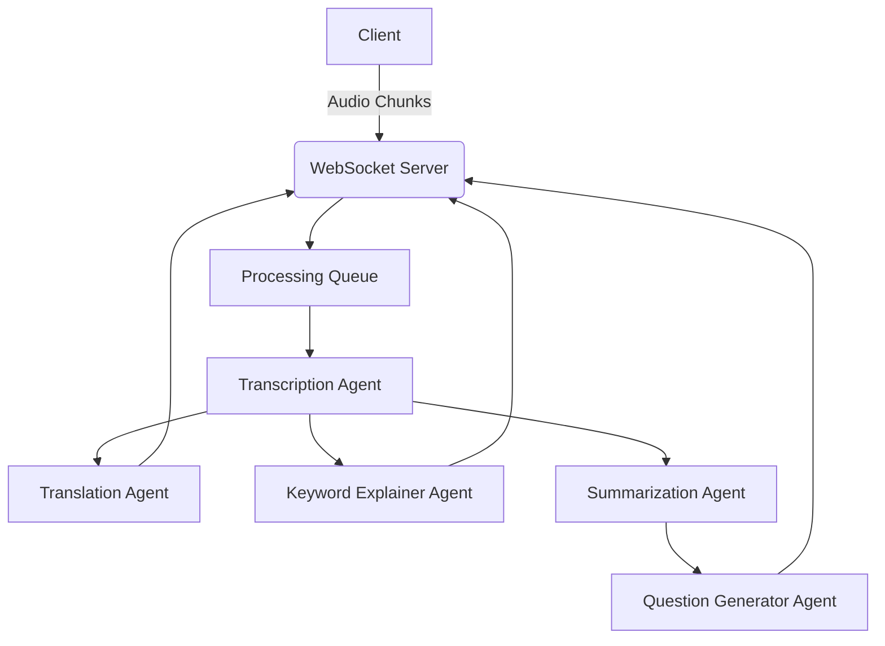

# Polyglot Meeting Whisperer - Backend

Polyglot Meeting Whisperer is a real-time meeting assistant that captures microphone audio in chunks, transcribes it, translates it, summarizes it, generates questions and extracts & explains buzz keywords — all using AI agents.

## Features

- 🎤 **Real-time Audio Transcription** using Whisper-large-v3
- 🌐 **Multi-language Translation** with LLama3
- 🔑 **Keyword Extraction & Explanation** for key concepts
- 📝 **Intelligent Summarization** with context preservation
- ❓ **Question Generation** for deeper understanding
- ⚡ **WebSocket Server** for efficient communication
- 🚀 **Asynchronous Processing** for high performance

## System Architecture



## Agents Overview

| Agent | Function | Model Used |
|-------|----------|------------|
| **TranscribeAgent** | Converts audio to text | Whisper-large-v3 |
| **TranslateAgent** | Translates text to target language | Llama-3.3-70b |
| **KeywordExplainerAgent** | Extracts and explains key concepts | Llama-3.3-70b |
| **SummarizerAgent** | Creates concise summaries | Llama-3.3-70b |
| **QuestionGeneratorAgent** | Generates insightful questions | Llama-3.3-70b |

## Installation

1. Clone the repository:
```bash
git clone https://github.com/Muhammad-Faizan-Soomro/polyglot-meeting-whisperer.git
cd backend
```

2. Install dependencies:
```bash
pip install -r requirements.txt
```

3. Create a `.env` file with your API key:
```env
GROQ_API_KEY=your_api_key_here
```

## Usage

### Start the WebSocket Server
```bash
python websocket_server.py
```

## Configuration

### Server Settings
Modify `websocket_server.py` to change:
- `PORT` (default: 8765)
- Processing parameters like `chunk_limit` in SummarizerAgent

### Environment Variables
| Variable | Description | Default |
|----------|-------------|---------|
| `GROQ_API_KEY` | Groq Cloud API key | *Required* |

## Response Format

The server returns JSON objects with these formats:

**Transcript Response:**
```json
{
  "type": "transcript",
  "data": "The full transcribed text"
}
```

**Translation Response:**
```json
{
  "type": "translated",
  "data": "Translated text in target language"
}
```

**Keywords Response:**
```json
{
  "type": "keywords",
  "data": [
    {"keyword": "AI", "definition": "Artificial Intelligence..."},
    {"keyword": "LLM", "definition": "Large Language Model..."}
  ]
}
```

## Requirements

- Python 3.8+
- Groq API key
- WebSocket client for communication
- Audio capture device for client

## License

This project is licensed under the MIT License. See [LICENSE](LICENSE) for details.
