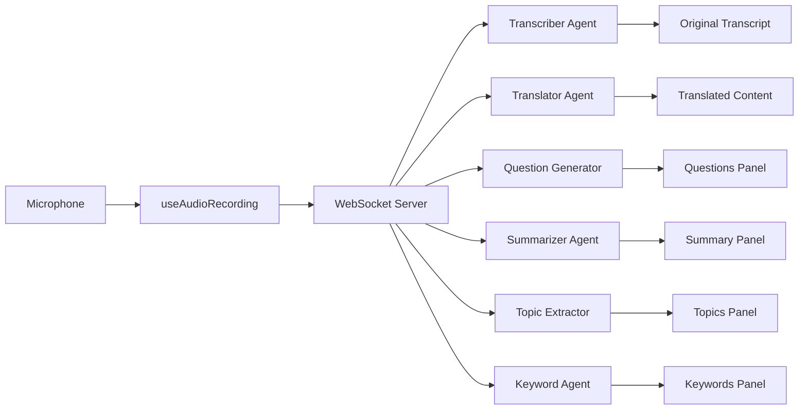

# 🌐 Polyglot Meeting Whisperer - Frontendn

Polyglot Meeting Whisperer is a real-time meeting assistant that captures microphone audio in chunks, transcribes it, translates it, summarizes it, generates questions and extracts & explains buzz keywords — all using AI agents.

## ✨ Features

- **Real-time Transcription**
- **Live Translation** to multiple languages
- **AI-Powered Insights**:
  - Automatic question generation
  - Dynamic meeting summarization
  - Topic extraction
  - Keyword explanations
- **Session Analytics**:
  - Word count tracking
  - Speaker statistics
  - Session duration timer
- **Export Capabilities** (JSON format)
- **WebSocket Integration** for real-time communication
- **Audio Chunk Processing** (5-second intervals)
- **Configurable Language Settings**

## 🧰 Technology Stack

- **Frontend**: 
  - React 18
  - Tailwind CSS
  - Lucide React (icons)
- **Real-time Communication**: WebSocket API
- **Audio Processing**: MediaRecorder API
- **State Management**: React Hooks (useState, useEffect, useRef)
- **Architecture**: Component-based UI with custom hooks

## 📁 Project Structure

```
src/
├── App.js               # Main application component
├── index.js             # Entry point
├── hooks/
│   └── useAudioRecording.js # Audio processing logic
├── utils/
│   └── translator.js    # Language utilities
├── components/
│   ├── AgentCard.js     # Agent status component
│   ├── ControlButtons.js# Recording controls
│   ├── Header.js        # Application header
│   ├── KeywordCard.js   # Keyword explanations
│   ├── QuestionCard.js  # Generated questions
│   ├── SettingsModal.js # Language settings
│   ├── StatsPanel.js    # Meeting statistics
│   ├── SummaryCard.js   # Meeting summary
│   ├── TopicCard.js     # Extracted topics
│   ├── TranscriptCard.js# Original transcript
│   └── TranslatedCard.js# Translated transcript
└── styles/
    └── globals.css      # Global styles
```

## 🚀 Getting Started

### Prerequisites
- Node.js v16+
- npm v8+
- WebSocket server running at `ws://localhost:8765`
- Browser with MediaRecorder API support

### Installation
1. Clone the repository:
```bash
git clone https://github.com/Muhammad-Faizan-Soomro/polyglot-meeting-whisperer.git
cd frontend
```

2. Install dependencies:
```bash
npm install
```

3. Start the development server:
```bash
npm start
```

4. Open in your browser:
```
http://localhost:3000
```

## 🎮 Usage

1. **Start Recording**:
   - Click the microphone button to begin capturing audio
   - Real-time transcription will appear in the left panel
   - Audio is processed in 5-second chunks

2. **View Translations**:
   - Translated text automatically appears in the right panel
   - Modify languages in Settings

3. **Access AI Insights**:
   - Generated questions appear in the Questions panel
   - Meeting summary updates dynamically
   - Topics and keywords populate as conversation progresses

4. **Export Data**:
   - Click Export to save meeting data as JSON
   - Includes transcripts, translations, and all AI insights

5. **Adjust Settings**:
   - Change default language through Settings modal

## 🧩 Key Components

### `useAudioRecording` Hook
Handles all audio processing logic:

```javascript
const useAudioRecording = ({
  onTranscriptUpdate,
  onTranslatedUpdate,
  onSummaryUpdate,
  onQuestionsUpdate,
  onKeywordsUpdate,
  onSessionStart,
  language,
}) => {
  // Hook implementation
};
```

**Features**:
- WebSocket connection management
- Audio capture via MediaRecorder API
- 5-second audio chunk processing
- Real-time message handling:
  - Transcript updates
  - Translated content
  - Meeting summaries
  - Generated questions
  - Keyword explanations
- Configurable language support

**Message Types Handled**:
```javascript
switch (message.type) {
  case "transcript": // Updates original transcript
  case "translated": // Updates translated content
  case "summary":    // Processes meeting summary
  case "questions":  // Handles generated questions
  case "keywords":   // Processes keyword explanations
}
```

### Agent System
6 specialized agents working in concert:
```js
const agents = [
  { icon: "📝", title: "Transcriber Agent", ... },
  { icon: "🌍", title: "Translator Agent", ... },
  { icon: "❓", title: "Question Generator Agent", ... },
  { icon: "📋", title: "Summarizer Agent", ... },
  { icon: "🏷", title: "Topic Extractor Agent", ... },
  { icon: "💡", title: "Keyword Explanation Agent", ... },
];
```

### Data Export
Generates comprehensive JSON output with:
```json
{
  "session": {
    "duration": "25:43",
    "timestamp": "2023-07-14T12:34:56.789Z",
    "summary": {
      "wordCount": 1245,
      "speakers": 3,
      "avgWords": 415
    }
  },
  "original": [
    {"speaker": "John", "text": "Hello team!", "time": "12:34:56"}
  ],
  "translated": [
    {"speaker": "", "text": "¡Hola equipo!", "time": "12:34:57"}
  ],
  "questions": [
    {"text": "What are our next steps?"}
  ],
  "summary": "Discussed project timeline...",
  "topics": ["Project Planning", "Timeline"],
  "keywords": [
    {"term": "NLP", "explanation": "Natural Language Processing"}
  ]
}
```

## 📚 Component Documentation

### Core UI Components

| Component | Props | Description | Features |
|-----------|-------|-------------|----------|
| **useAudioRecording** | Various callbacks, `language` | Audio processing hook | • WebSocket management<br>• MediaRecorder integration<br>• Real-time data processing |
| **SettingsModal** | `isOpen`, `onClose`, `language`, `onLanguageChange` | Language configuration | • Dropdown selector<br>• Glassmorphism UI |
| **StatsPanel** | `wordCount`, `speakerCount`, `avgWords`, `sessionDuration` | Analytics dashboard | • Gradient counters<br>• Responsive layout |
| **SummaryCard** | `summary`, `isLoading` | Meeting summary display | • Loading states<br>• Clean presentation |
| **TopicCard** | `topics`, `isLoading` | Extracted topics panel | • Numbered list<br>• Auto-update |
| **TranscriptCard** | `transcript`, `isLoading` | Original transcript | • Speaker identification<br>• Timestamps |
| **TranslatedCard** | `transcript`, `isLoading` | Translation output | • Bilingual support<br>• Auto-scroll |

### Data Flow


## 📜 License
This project is licensed under the MIT License - see the [LICENSE.md](LICENSE.md) file for details.
